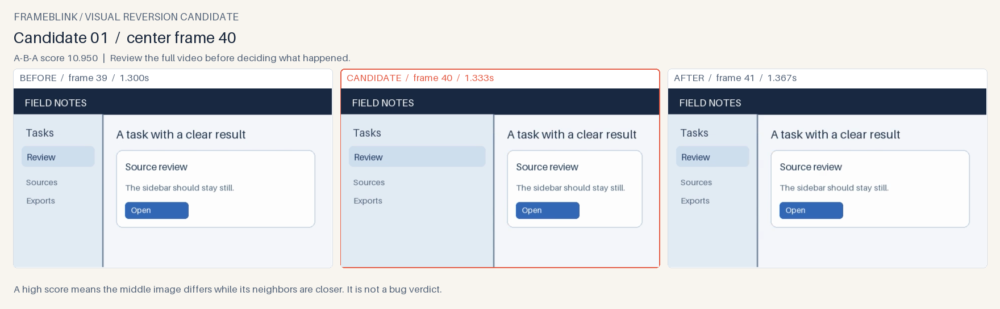

# Frameblink

**Catch the frame that came back.** When a screen recording shows a UI state flashing or jumping back for one frame, Frameblink ranks brief visual returns and places the actual **before / candidate / after** frames side by side. One local command writes a human review page, a few PNG triples and compact JSON for an agent to query.



Frameblink is an early preview for agents who already have a short MP4 or WebM bug recording. It answers *which adjacent frames should I inspect?* A high score is **not** a bug verdict, proof of root cause, or proof that every glitch was found.

## First result

Python 3.11+ is required. This preview is distributed as a GitHub release wheel, **not on PyPI**. Its PyAV dependency ships video-decoder wheels for the tested platforms, so a separate FFmpeg command is not part of the first-use path.

```sh
python -m pip install https://github.com/codex-improvement-lab/frameblink/releases/download/v0.1.0a1/frameblink-0.1.0a1-py3-none-any.whl
frameblink demo --out ./frameblink-demo
```

The demo video and UI are **authored illustrations**, not a customer bug. Open `frameblink-demo/review.html`. It should identify the one-frame sidebar jump at zero-based frame 40. The report links the generated `events.json` and shows a labeled three-frame PNG.

For your own already captured recording:

```sh
frameblink scan ./bug.mp4 --out ./bug-review --json
```

The output directory must not exist. Exit code 0 includes a valid **no candidate** result; exit 2 means an input or output setup error. `--threshold` (default `0.1`) and `--max-events` (default `6`, maximum `12`) are explicit options. A lower threshold can surface more candidates and false positives. The exported frame indices are zero based. Timestamps come from decoder presentation times relative to the first timed frame; check the original player if exact seek alignment matters.

## When to choose it

Frameblink is for a visual pattern **A→B→A**: the middle frame changes, then the next frame looks more like the first. It downsizes each decoded frame to 202-pixel grayscale, ranks `min(MAD(A,B), MAD(B,C)) − MAD(A,C)`, and gives you a handful of actual adjacent frames to inspect. It does not classify B as bad. A deliberate quick interaction, camera/encoder artifact, or user cursor movement can score too.

This is useful when ordinary scene-change extraction skips a tiny one-frame glitch and fixed-rate sampling would require reading hundreds of images. On a local trial with a [public Ghostty flicker report](https://github.com/ghostty-org/ghostty/discussions/11187), the scene-change baseline selected no frames at its normal threshold; Frameblink ranked a visually confirmed one-frame divider return first. On another public [RustDesk Wayland report](https://github.com/rustdesk/rustdesk/issues/11192), the highest candidates showed a window disappearing or appearing for one frame, while the reporter's X11 comparison yielded no candidate at the same threshold. Those recordings were used **locally for evaluation only** and are not included here. [Methods, alternatives and limits](docs/evaluation.md) separate this from general user validation.

If you need broad video summarization, speech, action interpretation or persistent visual changes, use a general tool such as [Peepshow](https://github.com/t0mtaylor/peepshow) or [Framesleuth](https://github.com/thestackhub1/framesleuth-agent), or inspect the full video yourself. Frameblink's first preview does not attempt those jobs.

## Input and sharing boundary

The video must be a **local MP4 or WebM** no larger than 100 MiB, at most 60 seconds, at most 1,800 decoded frames, and no dimension larger than 4,096 pixels. The tool reads only that file and writes only to the new output directory. It does not upload, post, call a model, sign in, or send telemetry.

The JSON contains the source byte hash, frame indices, scores and candidate metadata. A hash identifies the exact local bytes; it does **not** authenticate the recording. The PNGs contain visible pixels from the source recording. **Review every output before sharing it.** No candidate means only that this specific A→B→A score did not cross the chosen threshold. Smooth changes, long flicker, a one-way flash and changing camera views may need other methods.

To run from source: `python -m pip install -e .`, then `python -m unittest discover -s tests -v`. The authored demo and smooth-change control can be regenerated with `python scripts/make_demo.py`.

MIT · Elias S.W. / [Codex Improvement Lab](https://github.com/codex-improvement-lab)
