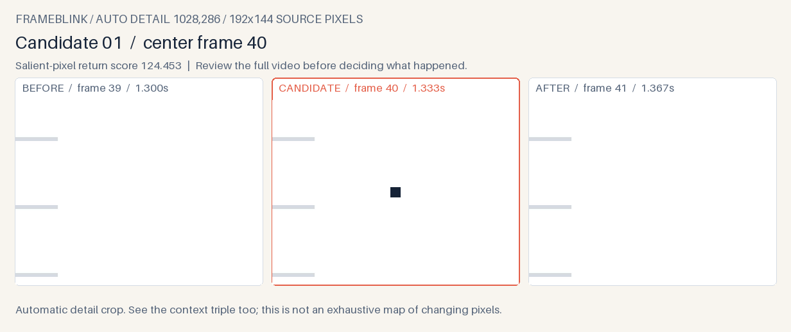
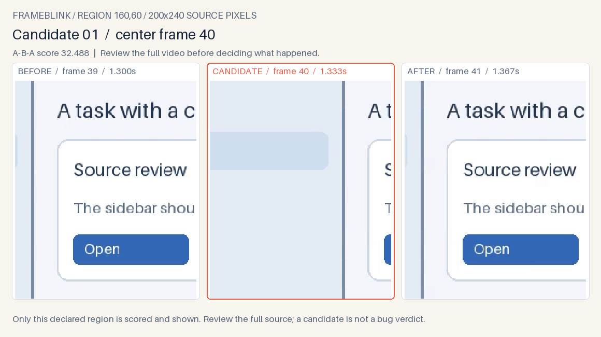

# Frameblink

**Catch the frame that came back.** When a screen recording shows a UI state flashing or jumping back for one frame, Frameblink ranks brief visual returns and places the actual **before / candidate / after** frames side by side. The adaptive default can surface small returns without a preselected region and adds an automatic detail crop while keeping the context triple. One local command writes a human review page, PNG triples and JSON for an agent to query.



[Full context for this authored example](docs/local-demo-context.png). The crop is an inspection aid; it does not mark every changing pixel.

[Watch the earlier 14-second large-jump walkthrough](docs/walkthrough.md): original speed, labelled slow motion, then the adjacent-frame result. The original demo remains available with `frameblink demo`; no customer recording is included.

Frameblink is an early preview for agents who already have a short MP4 or WebM bug recording. It answers *which adjacent frames should I inspect?* A high score is **not** a bug verdict, proof of root cause, or proof that every glitch was found.

## First result

Python 3.11+ is required. This preview is distributed as a GitHub release wheel, **not on PyPI**. Its PyAV dependency ships video-decoder wheels for the tested platforms, so a separate FFmpeg command is not part of the first-use path.

```sh
python -m pip install https://github.com/codex-improvement-lab/frameblink/releases/download/v0.2.0a1/frameblink-0.2.0a1-py3-none-any.whl
frameblink demo --small --out ./frameblink-demo
```

The demo video and UI are **authored illustrations**, not a customer bug. Open `frameblink-demo/review.html`. It should identify the 8×8 source-pixel pulse at zero-based frame 40, with a context triple and an automatic detail triple. The report links `events.json`. The original global-only score misses this authored pulse; `frameblink demo --small --mode global --out ./global-demo` preserves that comparison.

For your own already captured recording:

```sh
frameblink scan ./bug.mp4 --out ./bug-review --json
```

The output directory must not exist. Exit code 0 includes a valid **no candidate** result; exit 2 means an input or output setup error. `--max-events` defaults to `6`, with a maximum of `12`. `--threshold` controls the original full-area mean channel (default `0.1`); the adaptive supplementary channel has a fixed cutoff of `8` on its own distance. Use `--mode global` for the original scoring route and lower analysis cost. Lowering the global threshold can surface more candidates and false positives. Frame indices are zero based. Timestamps come from decoder presentation times relative to the first timed frame; check the original player if exact seek alignment matters.

## Inspect a small region

A small return can still be hidden by stronger simultaneous motion or downscaling. If you know the affected area, give its top-left position and size in **decoded source pixels**:

```sh
frameblink scan ./bug.mp4 --out ./region-review --region 600,300,240,160 --json
```

`--region X,Y,W,H` crops before both scoring channels and exports that same region in each context preview. Any automatic detail stays inside it. Frame indices and times still refer to the original recording. The rectangle must fit the video; scans require constant decoded dimensions. Regions are caller-selected, and a no-candidate result says nothing about changes outside them. Scores describe that selected area, not whole-page severity.

Try the mode on the included authored clip:

```sh
frameblink demo --out ./region-demo --region 160,60,200,240
```



The JSON records `analysis.region` (`null` for a whole-frame scan), `analysis.imageScope`, actual `analysisDimensions`, and `salientAnalysisDimensions`. Previews may be resized for readability; the source hash still identifies the complete input file. See the [0.2 preview notes](docs/RELEASE_NOTES_v0.2.0a1.md) and [JSON contract](docs/JSON_CONTRACT.md). Version 0.2 emits `frameblink-review/2`; consumers of schema 1 must account for multiple scoring channels and optional detail images.

## When to choose it

Frameblink is for a visual pattern **A→B→A**: the middle frame changes, then the next frame looks more like the first. The original channel uses 202-pixel-wide grayscale and full-area mean absolute differences. Adaptive mode adds a grayscale view capped at 960 pixels on its longest side and compares the mean of up to 64 strongest pixel differences. Each uses `min(d(A,B), d(B,C)) − d(A,C)`; eligible candidates are ranked relative to their channel's threshold. It does not classify B as bad. A deliberate quick interaction, camera/encoder artifact, or user cursor movement can score too.

This is useful when ordinary scene-change extraction skips a tiny one-frame glitch and fixed-rate sampling would require reading hundreds of images. On a local trial with a [public Ghostty flicker report](https://github.com/ghostty-org/ghostty/discussions/11187), the scene-change baseline selected no frames at its normal threshold; Frameblink ranked a visually confirmed one-frame divider return first. On another public [RustDesk Wayland report](https://github.com/rustdesk/rustdesk/issues/11192), the highest candidates showed a window disappearing or appearing for one frame, while the reporter's X11 comparison yielded no candidate at the same threshold. Those recordings were used **locally for evaluation only** and are not included here. [Methods, alternatives and limits](docs/evaluation.md) separate this from general user validation.

If you need broad video summarization, speech, action interpretation or persistent visual changes, use a general tool such as [Peepshow](https://github.com/t0mtaylor/peepshow) or [Framesleuth](https://github.com/thestackhub1/framesleuth-agent), or inspect the full video yourself. Frameblink's first preview does not attempt those jobs.

## Input and sharing boundary

The video must be a **local MP4 or WebM** no larger than 100 MiB, at most 60 seconds, at most 1,800 decoded frames, and no dimension larger than 4,096 pixels. Decoded dimensions must stay constant. The tool reads the local video and writes to the new output directory. It does not upload, post, call a model, sign in, or send telemetry.

The JSON contains the source byte hash, frame indices, scores and candidate metadata. A hash identifies the exact local bytes; it does **not** authenticate the recording. The PNGs contain visible pixels from the source recording. **Review every output before sharing it.** No candidate means only that this specific A→B→A score did not cross the chosen threshold. Smooth changes, long flicker, a one-way flash and changing camera views may need other methods.

To run from source: `python -m pip install -e .`, then `python -m unittest discover -s tests -v`. The original authored demo and smooth-change control can be regenerated with `python scripts/make_demo.py`; the small-pulse demo uses `python scripts/make_local_demo.py`.

MIT · Elias S.W. / [Codex Improvement Lab](https://github.com/codex-improvement-lab)
